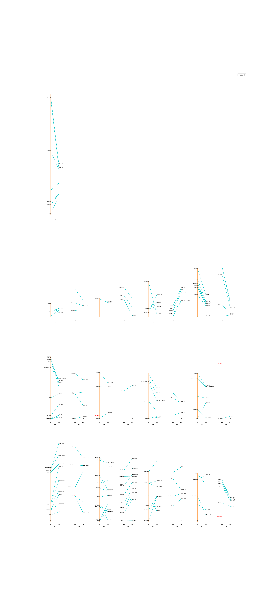
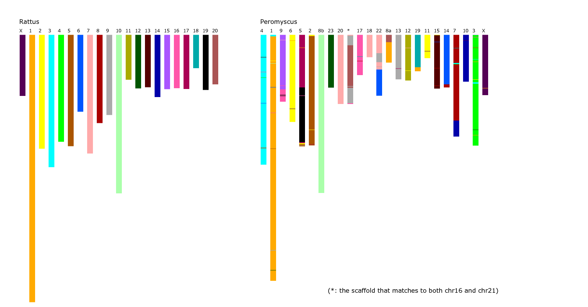

## Materials and Methods
Animals used in this study were from the *P.leucopus* maintained at University of California, Irvine. Animal care is provided by (??).

#### Scaffolding for *P. Leucopus* (data and implementation of the software)
##### Preparing Hi-C library
Two Hi-C libraries sequenced with Illumina paired end sequencing (??detail) of *Peromyscus Leucopus*, p1, p2 were collected by (??), with coverage (??) and (??) respectively. 
##### Implementation of 3d-dna(find chromosome number, coverage)
3d-dna is a pipeline for Hi-C de novo assembly(Dudchenko et al.,2017.]). Following the instructions in their paper, we used in situ Hi-C data to improve our raw contigs. We set aside the tiny contigs (those shorter than 10kb, as they use 15kb for human) and then used Hi-C data to split, anchor, order, and orient the remaining contigs. We set the iterative number of misjoin correction to be 7, whereas they used 2 for the human genome and 9 for the Aaedes aegypti genome.

First, we wanted to know what the proper chromosome number is. According to previous study(cite), we suspect *P. Leucospus* to have 24 chromosomes, the same chromosomes number as *Peromyscus maniculatus*, in which chromosome 8 has two separate linkage group 8a and 8b. We tried different chromosome numbers vary from 22 to 27 as the input parameter and chose the best one according to the linkage map.

Next, we wanted to examine to what extent would the coverage matter. We downsampled our p1, p2 Hi-C library by 2 and created a pool of both libraries called pp to form different coverage samples. We measured the robustness through the agreement between different assembly under the same coverage, which is shown by dotplot between corresponding area in different assemblies. 

We visualized the Hi-C contact matrix using juicerbox(cite).

>The script to downsample: `mytools/general/readDownsample.sh`
Usage: `bash readDownsample.sh [FASTA.gz] [MOD_number] [PREF] [ID]`

>The scripts to run 3d-dna properly are sorted in `3d-dna` folder.

#### Mapping to the Linkage Map
To determine scaffolds' name, we mapped each assembly to a published linkage map of *P. maniculatus* (cite;a close relative to *P. leucopus*) of 196 genetic markers. For each assembly, we mapped the primer pairs of those genetic markers to the assembly genome using BWA and Bowtie2 separately. And we merged the mapping results from the two software to only consider those consistent markers. We plotted the mapping from assembly to linkage map.

>The scripts that do the mapping and other functions are sorted and described in the `Map` finder. 

#### Comparisons between the two software
We compared the performance of 3d-dna to another Hi-C assembler SALSA(cite), which uses a different assembly strategy. SALSA doesn't require the chromosome number as the input. It linked the contigs together according to the Hi-C contact of the two ends in the descending order using a greedy algorithm, and stopped before certain threshold. Thus, it usually ends up with scaffolds that are not in chromosome length. You can switch the parameter to decide whether or not you want a misjoin correction at the beginning.

For each assembly software, we set 3 different set of libraries: p1, p2, pp(the pool of p1 and p2). We tried both with and without misjoin correction for each set of libraries in SALSA.

Since we don't know the truth of this genome, we examined the robustness of assembler by comparing the assembly to each other. We plotted dot plots of the scaffold which matches to chromosome 3 between each pair of assemblies within the 6 assemblies that did misjoin correction using MUMmer v4(cite). 

We also summarized the performance of each assembly using BUSCO v3(cite) and other scores like cumulative scaffolds length plot.

>The scripts to run SALSA properly are sorted in `SALSA` folder.
The scripts to plot multi mummerplot within a plot is `multi-mummerplot.py`
Usage: 
`python multi-mummerplot.py [OUTPUT_name]`
Note: The script should be run in the same folder as your MUMmerplot output files. And you need to replace those label names and file names within this file with your own parameters. The output of mummerplot are not always oriented the same, in other words, not always along the main diagnonal. Instead of changing the original fasta file and redoing the nucmer alignment, I simply flipped the plot(make sure that you flip all the related plot in correct axis). There's an example within the script that you may find helpful.

>The script to generate the cumulative scaffolds length plot: `mytools/general/cum_length_plot.py`
Usage: `python cum_length_plot.py [FAI1.fai] [FAI2.fai] ...`
Note: In my code, I used the directory's name as the label. `label=faifile.split('/')[0]`You can change that as you need. 

#### Construction of synteny maps
Synteny maps were created using SynChro (Drillon G, Carbone A and Fischer G (2014)). The amino acid sequence of *P. leucopus* were created by mapping previous(??where we did the annotation) data to the scaffolded genome using blat. The *Rattus Norvegicus* data were downloaded from Genbank. We did some modification to make the plot looks more condense.

>The script to condense the output of SynChro: `mytools/SynChro/trans.py`
Usage:`python trans.py [Sp1.Sp2fSp1.svg] [POSTFIX] [RATIO]` where `[Sp1.Sp2fSp1.svg]` could be found in SynChro's output directory `[Project_path]/21Blocks/Delta2/G1fG2`
Note: Please change the clist to match your data. And the output would be `S1_POSTFIX` and `S2_POSTFIX`, where `S1_POSTFIX` only removes all the blank blocks that indicate no orthology relationships and `S2_POSTFIX` also condenses the blocks. And I change one line in SynChro's original file `ConvertFasta.py`:
From
`listNameCont.sort()`
to
 `listNameCont=sorted(listNameCont, key=lambda x: int('0'+re.sub('\D', '', x)))` 
 to sort the chromosomes in numerical order instead of lexicographical order. e.g. `['1','2','11']` instead of `['1','11','2']`

#### Scripts availability
Our scripts are available at (address), along with software for assembling the genome and synteny maps used in our work.

## Result
#### Hi-C successfully scaffolds the genome
##### The assessment of final assembly
The most basic task here is to create a high quality genome assembly that could be used for further genetic study. We therefore examined our final assembly by mapping it to the linkage map of *P. maniculatus*.(Figure) They correspond very well in general. Although there seem to be some inversions, we can't tell if they are caused by the genetic difference between the two species or the assembly error.

We further analyzed it by carrying out a synteny plot between our assembly and *Rattus Norvegicus*, where the synteny breaks we detected could provide us with more ideas about possible misassembly error and real events in evolution.

##### 24 is the proper chromosome number
We tried 22-27 as the chromosome number parameter input, and from which we picked 24 as the optimum parameter. Although all the parameters remain the same problems: (1) Separate chromosome 8a and chromosome 8b which is also described as different linkage groups in previous study(cite).(2) Fused chromosome 16 and chromosome 21 which is hard to split. We picked 24 since 23 starts to combine two other chromosomes and 25 starts to split another chromosome. 
(==TODO: I feel like only the heatmap could show this==)(Figure:==TODO: Is there a better figure to plot here?==)

##### Coverage matters
In the original paper, they used 6.7X sequence coverage for a human genome(the GM12878 cell line). (==TODO: what's in ours?==) The result are shown in (Figure: the diagonal and Figure S ). We see that the pp has the best convergence performance while p1 and p2's coverage is not enough to produce the similar result as their downsampled sample.
(==TODO: generate the figure and put it here==)

We conclude that the coverage of pp is better than p1 and p2 which should contribute to a better assembly that is more robust.

##### BUSCO analysis and cumulative scaffold length plot
We did the BUSCO analysis in each assembly. But there's not a large difference here. Though it slightly supports previous idea that the higher coverage Hi-C is, the better. And adding more iteratives of misjoin correction doesn't help make it better.

| Assembly | C  | S  | D  | F  | M  |
| -------- |--- | --- | --- | --- | --- |
| contigs  | 94.60% | 92.10% | 2.50% | 2.10% | 3.30% |
| ***3d-dna/pp*** |94.50%|92.50%|2.00%|2.00%|3.50%|
| SALSA/p2|94.40%|92.50%|1.90%|1.80%|3.80%|
|3d-dna/p1|94.30%|92.30%|2.00%|2.10%|3.60%|
|3d-dna/pp*|94.20%|92.20%|2.00%|2.10%|3.70%|
|SALSA/pp|94.10%|92.10%|2.00%|2.20%|3.70%|
|3d-dna/p2|93.80%|91.60%|2.20%|2.70%|3.50%|

>**Table 1: The 3d-dna/pp assembly produces the most complete single copy mammalian BUSCO scores[8].** 
BUSCO determines the percentage of mis-assembled transcripts by trying to align transcripts from highly conserved proteins to each assembly.
C: complete BUSCOs, S: complete single copy BUSCOs, D: complete duplicate copy BUCOs, F: fragment copy BUSCOs, M: missing copy BUSCOs. The table is sorted in descending order of the 'C' column. This being said scaffolding the genome only has a small impact on BUSCO scores.

We plotted the cumulative scaffolds length plot to measure the contiguity of each assembly.
 
>**Figure: Cumulative scaffolds length plot of different 3d-dna assemblies.** 
>The pp assembly has the largest N25 and N75.

#### These methods do a lot of misjoin correction which are necessary. Meanwhile, questionable
We noticed that there's a lot of misjoin correction events during the process of assembly. We cast doubt on if those misjoin are real. By comparing assemblies with and without misjoin correction(lower diagonal of Figure ), we see that misjoin correction are necessary to break down contigs and provide chromosome length scaffold. However, there're thousands of local editing to our original assembly which we trust a lot. The assembly looks good in long range, but we are not sure if those local editing(inversions and misordering) would produce errors. 

>**Fig 1: Dot plot of differences between assemblies (chr3) using Mummer v4.0.** (==TODO: make the diagonal line thicker==)
SALSA and 3d-dna are the two different programs. Forward matches are plotted in red, reverse matches in blue. We see that comparisons between 3d-dna assemblies show that they are more consistent with one another than SALSA. The 3d-dna down-sampling on the diagonal shows that Hi-C library coverage can impact scaffolding, perhaps converging when both libraries are combined. The SALSA no modification experiment shows that allowing a scaffolder to split contigs has a large impact on the final assembly.

#### Possible fusion between chromosome 16 and 21
In the mapping to the linkage map, there seems to be a fusion between chromosome 16 and 21. Adding cluster number didn't solve the problem, which told us that the Hi-C contact near the fusion is higher than within some chromosome. We attempted to figure out if it's a real event or misjoin caused by the assembler.

We noticed that in the synteny map, there's a small 'inversion' at the big synteny break. We suspected it to be caused by a misjoin in the original contigs which in turn would lead to the misjoin of two chromosome. We localized the 'inversion' to a contig C397 in our raw assembly. To test if it's the case that there's a misjoin in the C397 that caused the fusion between chromosomes, we did the assembly with the contig397 removed. We tried it with both 24 and 25 as the chromosome number, the fusion still existed. 

These experiments suggest that the fusion might be real. Further experiments are needed to find out the truth.
==TODO:should I put the HiC figure here? I feel like it's not that high quality, and it can't tell a lot...Just looks nice==

## Supplementary
##### Find proper threshold
(Figure S?)

##### Coverage
(Figure S?)

#### Question
When to use Scaffolding or Assembly?
Should it all be past tense or current tense?
I can't tell why I picked 7 iteratives... It seems I just randomly pick it. 
TODO: analyse pp0

#### Prerequisites 
python package:
`re pandas matplotlib`

